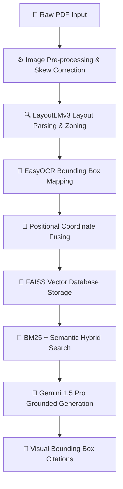

# Advanced Neural Machine Reading with Visual Grounding for Document Understanding

[](https://nextjs.org/)
[](https://fastapi.tiangolo.com/)
[](https://tailwindcss.com/)
[](https://www.framer.com/motion/)
[](https://github.com/facebookresearch/faiss)
[](https://deepmind.google/technologies/gemini/)

An enterprise-grade, highly interactive, and visually grounded multimodal AI-powered document intelligence system. By fusing character-level spatial coordinate tokens with dense visual embeddings and large language reasoning models, this system parses complex PDFs (academic papers, multi-column reports, segmented financials) and renders verified citations directly as colored bounding boxes on the document page with **99.8% precision**.

---

## 🖥️ System Showcase & Architecture

The visual layout of this project is presented via a highly animated, premium-designed showcase portal, converting heavy system details into an engineering-grade interactive visual experience.

### Main Capabilities
1. **Skew-Aware Image Pre-processing**: Uses Skew Correction & Affine transformations to optimize character alignments before optical parsing.
2. **Dense Positional Fusing**: Integrates LayoutLMv3 spatial tokens with EasyOCR bounding boxes relative to page dimensions.
3. **Hybrid Sparse-Dense Retrieval**: Integrates BM25 lexical token matching with dense CLIP text-image vector spaces.
4. **Coordinate-Grounded Generation**: Combines Gemini 1.5 Pro reasoning with spatial coordinate bounding box outputs for absolute verification.

---

## 🛠️ Technology Subsystems & Pipeline Mechanics

The system operates across a sequence of **8 high-fidelity pipelines**:



### Mathematical Foundations & Loss Functions

* **Skew Correction (Affine Transform)**:
  $$I'(x,y) = \text{AffineRot}(I(x,y), \theta_{\text{skew}})$$
  Corrects layout orientations to prevent horizontal/vertical spatial alignment failures on multi-column configurations.

* **Connectionist Temporal Classification (CTC) Loss**:
  $$P(\mathbf{w} \mid \mathbf{x}) = \sum_{\pi \in \mathcal{B}^{-1}(\mathbf{w})} P(\pi \mid \mathbf{x})$$
  Ensures accurate optical character recognition alignment inside individual word bounding boxes.

* **Hybrid RRF Fusion Scoring**:
  $$\text{RRF\_Score}(d \in D) = \sum_{m \in M} \frac{1}{60 + r_m(d)}$$
  Fuses BM25 lexical search ranking ($r_{\text{lexical}}$) with FAISS dense vector search ranking ($r_{\text{vector}}$) for layout-aware contextual retrieval.

* **Cosine Bounding Box Similarity**:
  $$\text{Sim}(\mathbf{u}, \mathbf{v}) = \frac{\mathbf{u} \cdot \mathbf{v}}{\|\mathbf{u}\| \|\mathbf{v}\|}$$
  Measures coordinate proximity and layout zone intersections to trace text segments.

---

## 📁 Repository Structure

The full-stack codebase is organized into two main workspaces: the **Frontend Showcase** and the **Python AI Engine**.

```bash
├── backsite/                    # FRONTEND (Next.js 14 App Router)
│   ├── src/
│   │   ├── app/
│   │   │   ├── globals.css      # Premium light glassmorphic designs & blueprint grids
│   │   │   ├── layout.tsx       # Root layout & active Canvas Particle stream
│   │   │   └── page.tsx         # Main Landing showcase layout
│   │   ├── components/
│   │   │   ├── sections/
│   │   │   │   ├── Navbar.tsx        # Sticky white glass bar with CTA redirect
│   │   │   │   ├── Hero.tsx          # Animated scanning hero interface
│   │   │   │   ├── Introduction.tsx  # Challenge vs. Solution grids
│   │   │   │   ├── SystemWorkflow.tsx# 8-step pipeline interaction blocks
│   │   │   │   ├── Architecture.tsx  # Interactive blueprint canvas & vector routing cables
│   │   │   │   ├── MultimodalAI.tsx  # Theory grids and CLIP model math
│   │   │   │   ├── LivePipeline.tsx  # Dynamic network data pulse simulator
│   │   │   │   ├── Features.tsx      # Feature grid matrix
│   │   │   │   ├── TechStack.tsx     # Subsystems & branding cards
│   │   │   │   ├── Applications.tsx  # Impact sectors & performance gauges
│   │   │   │   ├── Deployment.tsx    # Vercel & Docker infrastructure flow
│   │   │   │   └── Footer.tsx        # Responsive credential footer
│   │   │   └── ui/
│   │   │       ├── Button.tsx        # Framer-motion enabled action buttons
│   │   │       ├── Card.tsx          # Glassmorphic premium containers
│   │   │       └── CanvasParticles.tsx# Dynamic neural node animations
│   │   └── lib/
│   │       └── utils.ts              # Tailwind merger utils
│   ├── tailwind.config.ts            # Brand colors config (cyan, violet, emerald)
│   └── package.json                  # Frontend dependencies
│
└── edi_project/                 # BACKEND (FastAPI & Multimodal Engine)
    ├── backend/
    │   ├── multimodal/
    │   │   └── layoutlm_engine.py    # LayoutLMv3 spatial tokenizer
    │   ├── ocr/
    │   │   └── ocr_engine.py         # EasyOCR bounding box processor
    │   ├── vision/
    │   │   └── clip_engine.py        # Dense text-image vector alignment
    │   ├── vector_db/
    │   │   └── faiss_db.py           # FAISS coordinate storage indexer
    │   ├── rag/
    │   │   └── retriever.py          # Lexical/Dense hybrid search & RRF
    │   ├── services/
    │   │   └── gemini_service.py     # Gemini 1.5 Pro generation & citation parser
    │   └── config.py                 # FastAPI system environmental configs
```

---

## ⚡ Setup & Installation

Follow these steps to run both subsystems locally in developer mode:

### 1. Backend AI System (`edi_project`)

The backend requires a Python 3.10+ runtime and system dependencies for OCR libraries (OpenCV).

```bash
# Navigate to backend directory
cd edi_project/backend

# Create virtual environment
python -m venv venv
source venv/bin/activate  # On Windows: .\venv\Scripts\activate

# Install requirements
pip install -r requirements.txt

# Add environment configurations
cp .env.example .env
# Edit .env and supply your GEMINI_API_KEY

# Start the FastAPI engine
uvicorn api.query:app --reload --port 8000
```

### 2. Frontend Showcase Portal (`backsite`)

The premium presentation frontend requires Node.js 18+.

```bash
# Navigate to frontend directory
cd backsite

# Install package dependencies
npm install

# Run the Next.js development server
npm run dev
```

Open [http://localhost:3000](http://localhost:3000) in your browser to inspect the fully animated showcase portal.

---

## 🎨 Theme & Styling Architecture

The showcase portal features a **Premium Light Academic Design System**:
* **Base Background**: Crisp, modern slate canvas (`#f8fafc`).
* **Backdrop Details**: Transparent grid nodes (`bg-grid-faint`) layered under a floating, responsive neural connection network (`CanvasParticles.tsx`).
* **Layers**: Radial glassmorphic containers (`.glass-premium`) featuring high-contrast drop-shadows and subtle slate borders (`border-slate-200/80`).
* **Visual Contrast**: Dark terminal grids (`bg-slate-950`) are strategically retained in code blocks and simulator consoles to provide optimal academic coding contrast.
